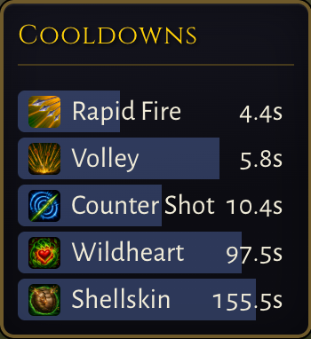

<div align="center">


[**woc.marshal.dev**](https://woc.marshal.dev)

One install adds an **Addons** entry to the game menu: browse a built-in marketplace,
install an addon, configure it, all inside the game.


</div>

## What it is

**Fully external to the game.** No game source is modified and no build is forked. The loader reaches the game only through surfaces a browser already gets: the `window.__game` global, the WebSocket, HUD DOM ids, and the audio pack. That constraint is the whole design, and it is why this can exist at all without the game's cooperation.

It is also **read-only by design**. No send API, no synthetic input, no automation of play. Addons reformat, aggregate and re-present information the player already has.

Works on all three deployments:

| Channel | Origin |
|---|---|
| live | `https://worldofclaudecraft.com` |
| pbe | `https://pbe.worldofclaudecraft.com` |
| pbe2 | `https://pbe2.worldofclaudecraft.com` |

## Install

1. Install [Violentmonkey](https://violentmonkey.github.io/) or [Tampermonkey](https://www.tampermonkey.net/).
2. On Chromium, turn on **Allow User Scripts** for that extension. This is the step that fails silently.
3. **[Install woc-loader.user.js →](https://github.com/MarshalX/world-of-claudecraft-addons/releases/latest/download/woc-loader.user.js)** Your manager intercepts the link, shows you the source and the permissions it asks for, and waits for you to confirm.
4. Open the game, press <kbd>Esc</kbd>, and look for **Addons** at the bottom of the Game Menu.

**[Full instructions, per browser →](https://woc.marshal.dev/install)**

The per-browser procedure lives on the site rather than here, because two copies of a fiddly set of steps means one of them is wrong.

## What ships with it

**[Combat Meter](addons/combat-meter)** — what your damage and healing are made of: a row per ability with crit rate, average and biggest hit, plus your real miss and dodge rates and what is hitting you. The game has its own meter; this answers what that one does not.


**[Cooldown Bars](addons/cooldown-bars)** — a draining bar for every ability on cooldown, soonest ready at the top, with an exact bar for anything regenerating a charge. It is also **the example to copy**: one file, no build step, and it teaches the one thing that is not obvious from the API.



**[Dev Harness](addons/dev-harness)** — exercises every API surface and reports what it found, which is how the loader gets checked against a live game rather than only against a test.

[The full catalog →](https://woc.marshal.dev/addons)

## For addon authors

An addon is a directory with a manifest and one plain JavaScript file. No bundler, no framework, no build step.

```
addons/my-addon/
  addon.json
  main.js
```

```js
/// <reference types="@woc-addons/types" />

const win = woc.ui.frame({ id: 'main', title: 'My Addon', save: true });

woc.net.onEvent('damage', (event) => {
  win.body.textContent = String(event.amount);
});

woc.keys.bind('toggle', () => {
  win.toggle();
  woc.sound.play('ui_click');
});
```

No export, no registration call, and no cleanup: the file is evaluated as a function body with `woc` already in scope, and everything the API creates is torn down when the addon is disabled.

**[Authoring docs →](https://woc.marshal.dev/docs/)** covers the manifest, the whole `woc` surface, publishing, and the patterns nobody derives from a signature. The full type surface is published as [`@woc-addons/types`](packages/types).

One worth internalising before you start: a field can be declared on the game's entity, be readable, and never be sent. `inCombat` is one, and it holds `false` for a whole session. Check what you read against the wire, not against a type.

## Trust

**Installing an addon is equivalent in trust to installing a browser extension.** Addon code runs in the game page and can read anything the page can, including your session token. The `woc` API is an ergonomic surface, not a security boundary.

The official marketplace is the trust anchor: it ships with the loader, cannot be removed, and its contents are reviewed. Adding a third-party marketplace means trusting whoever maintains it with your account. The loader says so at that moment, and shows what each addon declares before it runs.

## Development

```sh
corepack enable
pnpm install
pnpm check      # typecheck, lint, test, validate manifests
pnpm build      # emits loader/dist/woc-loader.user.js
pnpm dev        # watch build, plus the addon dev server on :5180
pnpm serve      # the addon dev server on its own
pnpm site       # build the site into site/dist
pnpm site:dev   # build the site, serve it on :5181, rebuild on change
pnpm index      # regenerate marketplace.json from the addon.json files
pnpm changelog  # regenerate CHANGELOG.md from commit titles
pnpm cues       # regenerate the sound-cue union from a deployed game's pack
pnpm icons      # regenerate the skill-icon union from its per-class art manifests
```

Develop against `pbe` or `pbe2`. They run ahead of live, so game drift shows up there first.

`packages/types` is published by hand, from that directory: `npm publish`. It is versioned against the loader's `apiVersion` rather than against the loader, so it only needs a release when the addon API surface changes.

Working instructions are in [AGENTS.md](AGENTS.md), and the lint and type rules worth knowing before you write a module are in [STYLE.md](STYLE.md).

## License

MIT. Not affiliated with or endorsed by the World of ClaudeCraft project.
