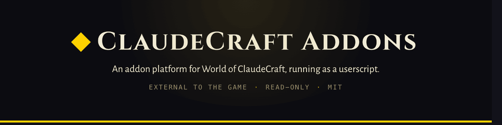
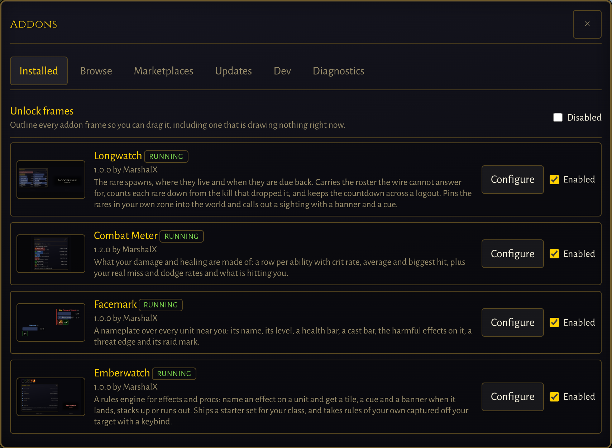
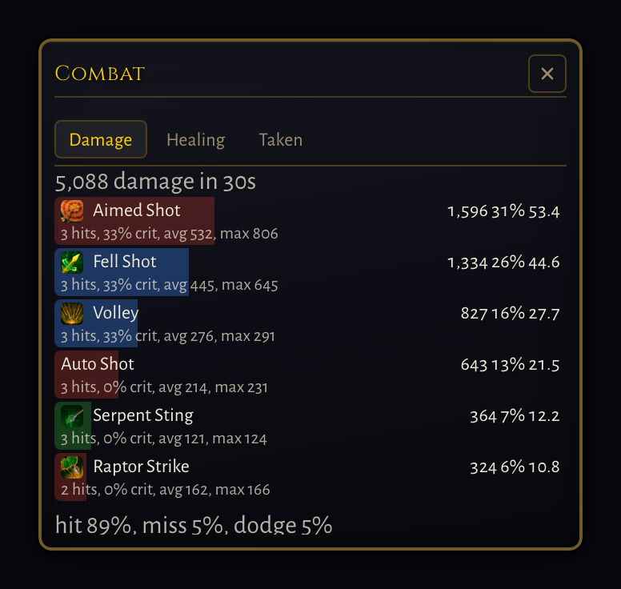
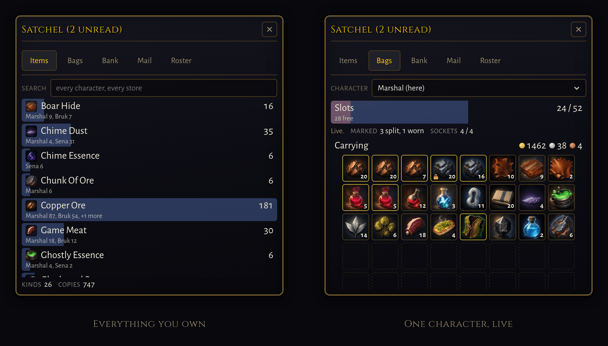
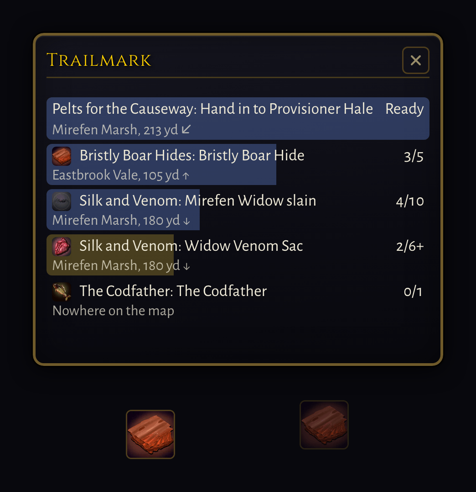
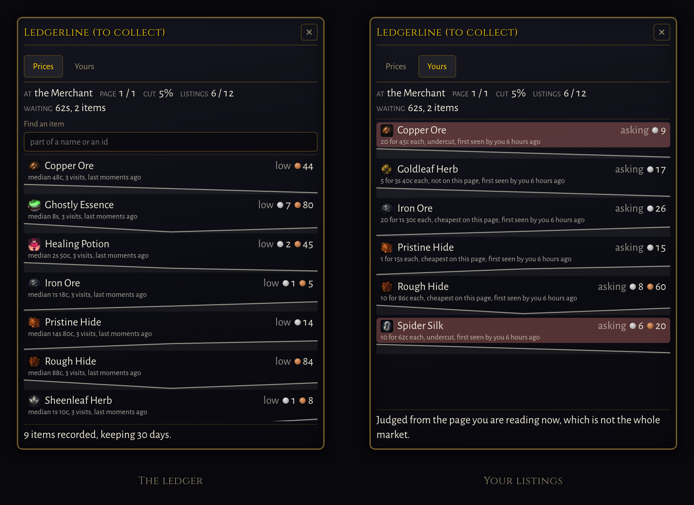

<div align="center">



[**woc.marshal.dev**](https://woc.marshal.dev)

One install adds an **Addons** entry to the game menu: browse a built-in marketplace,
install an addon, configure it, all inside the game.



</div>

## What it is

**Fully external to the game.** No game source is modified and no build is forked. The loader reaches the game only through surfaces a browser already gets: the `window.__game` global, the WebSocket, HUD DOM ids, and the audio pack. That constraint is the whole design, and it is why this can exist at all without the game's cooperation.

It is also **read-only by design**. No send API, no synthetic input, no automation of play. Addons reformat, aggregate and re-present information the player already has.

Works on all three deployments:

| Channel | Origin |
|---|---|
| live | `https://worldofclaudecraft.com` |
| pbe | `https://pbe.worldofclaudecraft.com` |
| pbe2 | `https://pbe2.worldofclaudecraft.com` |

## Install

1. Install [Violentmonkey](https://violentmonkey.github.io/) or [Tampermonkey](https://www.tampermonkey.net/).
2. On Chromium, turn on **Allow User Scripts** for that extension. This is the step that fails silently.
3. **[Install woc-loader.user.js →](https://github.com/MarshalX/world-of-claudecraft-addons/releases/latest/download/woc-loader.user.js)** Your manager intercepts the link, shows you the source and the permissions it asks for, and waits for you to confirm.
4. Open the game, press <kbd>Esc</kbd>, and look for **Addons** at the bottom of the Game Menu.

**[Full instructions, per browser →](https://woc.marshal.dev/install)**

The per-browser procedure lives on the site rather than here, because two copies of a fiddly set of steps means one of them is wrong.

## What ships with it

<!-- addons:start -->

**16 addons ship with the loader**, reviewed and installed from inside the game. Five of them:

**[Combat Meter](addons/combat-meter)** — Damage, healing and damage taken broken down per ability, pet included, with rates, crits and your real miss and dodge rates. Pages back through past fights, kept across a reload.



**[Satchel](addons/satchel)** — Everything you own, on every character: bags, bank, Materials Vault and mailbox pooled into one row an item; hover for who holds how many where. Vault materials against their cap, and vendor value.



**[Facemark](addons/facemark)** — A nameplate over every unit: health, casts, effects and raid marks. It names the side each player is on in PvP, which no field says, and whether a cast is coming at you.


**[Trailmark](addons/trailmark)** — Where the thing your quest wants actually is: the zone, the distance, the way to turn and a world pin for every objective in your log, and who takes each quest that is ready.



**[Ledgerline](addons/ledgerline)** — A price history for a market that keeps almost none, and a scanner over it: every page you read at the Merchant is written down, each listing is judged against the vendor's floor, the page's own second-cheapest and your recorded prices, what is worth buying is ranked by what you would clear on the resale.



### The other 11

- **[Cadence](addons/cadence)** — Your swing, the global cooldown, your cast with a latency band, and your resource with combo points as pips, on one strip.
- **[Cooldown Bars](addons/cooldown-bars)** — A draining bar for every ability you have on cooldown, soonest ready first, measured against the real length of anything in your own spellbook.
- **[Emberwatch](addons/emberwatch)** — Name an effect on a unit and get a tile, a cue and a banner when it lands, stacks or fades.
- **[Foretell](addons/foretell)** — A cast bar for every cast near you, soonest first, as a column or floating over each caster.
- **[Longwatch](addons/longwatch)** — The rare spawns, where they live and when they are due back.
- **[Lorebind](addons/lorebind)** — A browser for every item in the game, and the name service every other addon subscribes to.
- **[Purelight](addons/purelight)** — Every effect in front of you that can be removed, worst first: on you, your pet, your group and your target, each tile naming who carries it.
- **[Tocsin](addons/tocsin)** — What a raid boss is about to do and what the group must answer, for Nythraxis, Ignivar and Varkhul: a timer per mechanic, who is marked, who is short on a soak, which water is left, and tank stacks.
- **[Veinsight](addons/veinsight)** — Every ore vein, wood stand and herb patch in the world, pinned where it stands and listed nearest first with a distance, a bearing and your own respawn timer.
- **[Wayfarer](addons/wayfarer)** — An atlas: where everything is, how far, and which way.
- **[Wayline](addons/wayline)** — How far the next level is in time rather than in numbers: experience per hour over a rolling window, the kills and the time left to reach it, and a derived virtual level past the cap.

[The full catalog, with a screenshot of each →](https://woc.marshal.dev/addons)

Shipped for people writing addons rather than playing with them, installed from **Addons → Browse** like anything else, and deliberately not in the list above:

- **[Dev Harness](addons/dev-harness)** — Exercises every part of the addon API and reports what worked, repainting as the world moves, so a loader change can be checked in the game rather than only in a test.

<!-- addons:end -->

## For addon authors

An addon is a directory with a manifest and one plain JavaScript file. No bundler, no framework, no build step.

```
addons/my-addon/
  addon.json
  main.js
```

```js
/// <reference types="@woc-addons/types" />

const win = woc.ui.frame({ id: 'main', title: 'My Addon', save: true });

woc.net.onEvent('damage', (event) => {
  win.body.textContent = String(event.amount);
});

woc.keys.bind('toggle', () => {
  win.toggle();
  woc.sound.play('ui_click');
});
```

No export, no registration call, and no cleanup: the file is evaluated as a function body with `woc` already in scope, and everything the API creates is torn down when the addon is disabled.

**[Authoring docs →](https://woc.marshal.dev/docs/)** covers the manifest, the whole `woc` surface, publishing, and the patterns nobody derives from a signature. The full type surface is published as [`@woc-addons/types`](packages/types).

One worth internalising before you start: a field can be declared on the game's entity, be readable, and never be sent. `inCombat` is one, and it holds `false` for a whole session. Check what you read against the wire, not against a type.

## Trust

**Installing an addon is equivalent in trust to installing a browser extension.** Addon code runs in the game page and can read anything the page can, including your session token. The `woc` API is an ergonomic surface, not a security boundary.

The official marketplace is the trust anchor: it ships with the loader, cannot be removed, and its contents are reviewed. Adding a third-party marketplace means trusting whoever maintains it with your account. The loader says so at that moment, and shows what each addon declares before it runs.

## Development

```sh
corepack enable
pnpm install
pnpm check      # typecheck, lint, test, validate manifests
pnpm build      # emits loader/dist/woc-loader.user.js
pnpm dev        # watch build, plus the addon dev server on :5180
pnpm serve      # the addon dev server on its own
pnpm site       # build the site into site/dist
pnpm site:dev   # build the site, serve it on :5181, rebuild on change
pnpm index      # regenerate marketplace.json from the addon.json files
pnpm readme     # regenerate the addon section of this file from the manifests
pnpm changelog  # regenerate CHANGELOG.md from commit titles
pnpm cues       # regenerate the sound-cue union from a deployed game's pack
pnpm icons      # regenerate the skill-icon union from its per-class art manifests
```

Develop against `pbe` or `pbe2`. They run ahead of live, so game drift shows up there first.

A release is one button: Actions, Release, Run workflow, with the version typed into the form. The run gates the tree, builds and checksums the userscript, tags it, publishes the GitHub release, publishes `@woc-addons/types` if its version moved, regenerates `CHANGELOG.md` and redeploys the site.

`packages/types` is versioned against the loader's `apiVersion` rather than against the loader, so it only needs a release when the addon API surface changes. Bump it in the commit that changes the surface; the release run publishes it whenever the tree is ahead of the registry, over npm trusted publishing, with no token anywhere.

Working instructions are in [AGENTS.md](AGENTS.md), and the lint and type rules worth knowing before you write a module are in [STYLE.md](STYLE.md).

## License

MIT. Not affiliated with or endorsed by the World of ClaudeCraft project.
